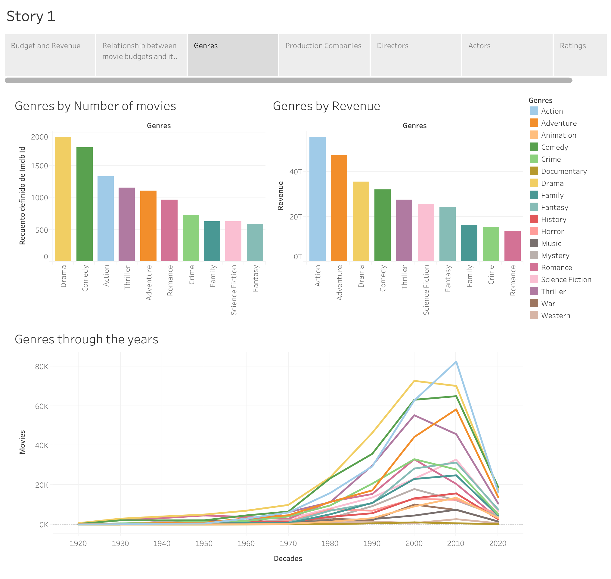

# Análisis económico de la industria cinematográfica

Este proyecto se centra en analizar tendencias en las películas a lo largo de las décadas, como géneros, productoras populares, calificaciones, recaudaciones de taquilla, presupuesto y los directores y actores más exitosos de cada período.

## Organización del repositorio

## Colección de Datos

Hemos extraído datos de la API de TMDB (The Movie Database), una base de datos en línea muy utilizada que proporciona información sobre películas, programas de televisión, actores y más. Nos hemos centrado en un extraer las 100 películas más taquilleras de cada año desde el 1920.

## Tratamiento de Datos

Tras realizar la limpieza de los datos y quedarnos con las péliculas más relevantes y con datos completos, tenemos un dataset de 4791 péliculas. Los datos son estos: 

- Imdb ID: Un identificador único asignado a cada película.
- Título: El título oficial de la película.
- Género: La categoría o tipo de la película (por ejemplo, drama, comedia, acción, etc.).
- Productora: La empresa o empresas que produjeron la película.
- Director: La persona que dirigió la película.
- Reparto: Los actores y actrices que participaron en la película.
- Presupuesto: El costo de producción de la película.
- Facturación en taquilla: La cantidad total de dinero que la película ha recaudado en taquilla.
- Rating: La calificación promedio de la película, asignada por los espectadores.

## Visualización de los Datos
Utilizando la herramienta Tableau, creamos un story con diferentes dashboards interactivos que nos permiten consultar los datos más relevantes de la industria cinematográfica .

[Aquí podéis acceder al dashboard](https://public.tableau.com/app/profile/zakaria.alattar.kada/viz/MoviedashboardDefinitive/Story1?publish=yes)

