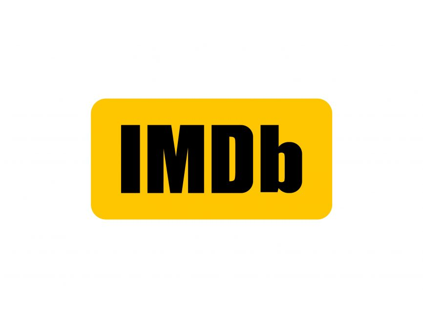

# Análisis de Cine por Décadas

Este proyecto se centra en analizar tendencias en las películas a lo largo de las décadas, como géneros, productoras populares, calificaciones, recaudaciones de taquilla, presupuesto y los directores y actores más exitosos de cada período.

## Colección de Datos

Se necesitará un conjunto de datos que contenga información sobre las fechas de lanzamiento, géneros, calificaciones, recaudaciones de taquilla, presupuestos, directores y actores de cada película.  Tendremos acceso a ellos gracias a directorios web como IMDb, TMDB o Box Office Mojo. Se hará un scraping de los datos de IMDb y Box Office Mojo, así como se conseguirán datos desde la API de TMDB

  

  

## Organización del repositorio

---

## Análisis

Una parte del análisis será un estudio de los generos dominantes a lo largo de las decadas, así como ver si se pueden detectar ciertas tendencias que ayuden a detectar si se puede predecir cuando va a durar la dominancia de un género cinemático concreto.

Se pretende también estudiar la relación entre diferentes aspectos de una pélicula y su exito en taquilla.

También queremos ver si la relación existente entre el rating de una película y su éxito en taquilla.

